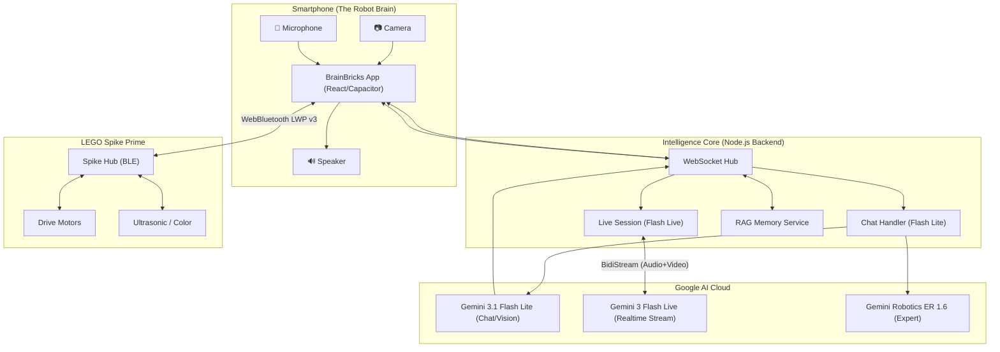

# BrainBricks System Architecture Schematic

### Workflow:
1. **Perception**: Camera/Mic stream via WebSocket to server
2. **Standard Mode**: Gemini 3.1 Flash Lite for conversational AI + vision analysis  
3. **Live Mode**: Gemini 3 Flash Live for real-time bidirectional audio/video streaming
4. **Expert Handoff**: Complex robotics tasks delegate to Gemini Robotics ER 1.6
5. **Execution**: AI generates motor commands → WebBluetooth → LEGO Hub
